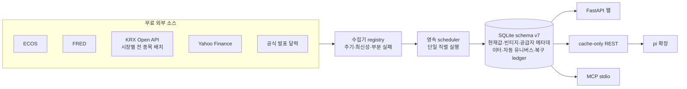
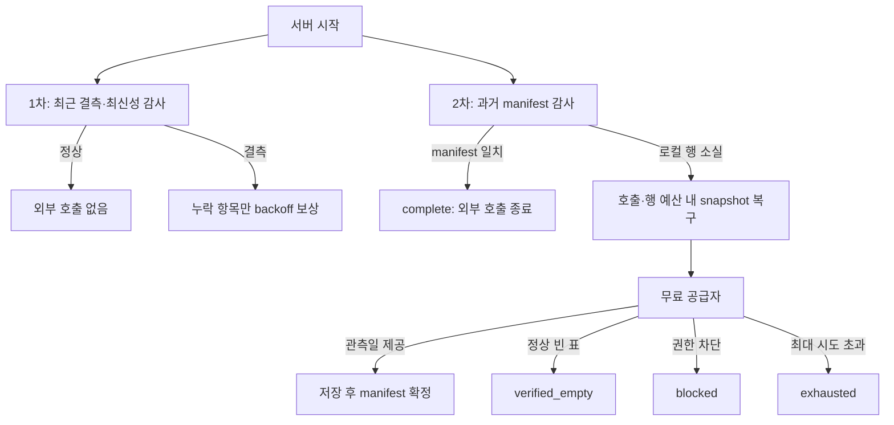

# 시스템 아키텍처

## 데이터 흐름

외부 네트워크 호출은 수집기에만 있습니다. 웹 페이지, REST API, MCP는 SQLite에 저장된 마지막 성공 데이터를 읽으므로 사용자 요청이 공급자 호출량이나 응답 지연을 늘리지 않습니다.

## 구성 요소

### 수집과 스케줄링

- `app/collectors/`: 공급자 응답을 `{date, value}`와 정규화된 quote/event로 변환합니다.
- `app/registry.py`: 계열 주기, 수집 간격, 최신성, 배치별 오류를 정의합니다.
- `app/scheduler.py`: SQLite의 마지막 시도·성공 시각을 복원하고 due 작업과 결측 보상 작업을 직렬 실행합니다.
- `app/collect.py`: 같은 registry를 사용하는 수동 실행 진입점입니다.

수집 성공은 `ok == total`일 때만 기록합니다. 일부 계열만 성공하면 기존 성공 데이터는 유지하면서 상태를 `partial`로 남깁니다. 빈 지수 이력으로 기존 데이터를 교체하는 동작은 거부합니다.

지표의 “관측값이 오래됨”과 “공급자를 다시 호출할 시각”은 분리합니다. 전자는 관리 화면과 reconciliation의 품질 신호이고, 후자는 영속 interval과 repair backoff로 제어합니다. 지표·관심 종목·지수는 누락된 항목만 선별 보상하므로 한 계열 때문에 정상 배치 전체를 반복 호출하지 않습니다.

서버 시작 직후와 기본 5분 간격으로 1차 최신성 감사를 수행합니다. 별도의 2차 과거 감사는 공급자가 실제 반환한 관측일 manifest와 SQLite를 비교합니다. 고정 대상이 `complete`, `verified_empty`, `blocked`, `exhausted` 중 하나가 되면 소스·정책 fingerprint 변경이나 명시적 reset 전에는 외부 공급자를 다시 호출하지 않습니다. 모든 실행은 기존 단일 lock 안에서 직렬화됩니다.

### 저장

`app/db.py`가 schema v7과 멱등 마이그레이션을 소유합니다.

| 테이블 | 책임 |
|--------|------|
| `events` | KST 일정과 원문 provenance |
| `indicator_points` | 계열별 현재 관측값 |
| `indicator_vintages` | 값이 변경된 관측치의 수집 시점별 revision |
| `series_catalog` | label, unit, source series, frequency, 계열별 최신성, 공급자 선택 조건, 분석 그룹, 우선순위, proxy 여부, 원문 URL |
| `quotes`, `index_quotes` | 관심 종목·지수 현재가 캐시 |
| `index_prices` | 글로벌 지수 일별 이력 |
| `market_instruments` | KRX 응답에서 자동 발견한 전체 종목 카탈로그 |
| `market_daily` | 공급자·데이터셋·종목·일자별 정규화 값과 원본 필드 |
| `market_dataset_runs` | 휴장일을 포함한 데이터셋·일자별 성공/빈 값/오류 상태 |
| `collector_state`, `collect_log` | 마지막 상태와 실행 이력 |
| `recovery_ledger` | 2차 대상별 공급자 manifest, 시도 횟수, 종료·차단 상태 |
| `meta` | schema 및 카탈로그 버전 |

### 분석

`analysis.py`, `correlation.py`, `spillover.py`, `market_metrics.py`는 DB에서 읽은 값만 계산합니다. 날짜가 다른 계열은 교집합으로 맞추고, 상관 행렬은 쌍별 표본 수를 함께 반환합니다. `market_metrics.py`는 REST와 에이전트가 공유하는 날짜 정렬 파생지표와 KRX 시장폭을 제공해 계산식 중복을 막습니다. 연결성은 변수 순서에 덜 민감한 generalized FEVD를 사용하며 인과관계로 표현하지 않습니다.

### 자동 시장 유니버스와 자원 상한

`app/collectors/krx.py`는 개별 심볼 목록을 갖지 않습니다. KRX의 날짜별 시장 테이블 한 건을 요청해 응답의 모든 행을 저장하고, 처음 본 종목을 `market_instruments`에 자동 등록합니다.

- 기본 `balanced`: 13개 데이터셋, 전체 지수군·KOSPI/KOSDAQ/KONEX 주식·ETF/ETN·일반상품
- `light`: 7개 데이터셋, 대표 지수군·ETF·일반상품
- `all`: KRX 공개 카탈로그 31개 데이터셋. ELW·채권·선물·옵션·ESG까지 포함
- 최초 최근 5거래일만 채우고 이후 일별 증분 수집
- 데이터셋당 20,000행, 실행당 100,000행을 넘으면 저장 전 중단
- 성공 또는 휴장일 빈 응답을 데이터셋·일자별로 기록해 재시작 후 중복 호출 방지

### 소비자

- `app/main.py`: 읽기 전용 웹과 REST API. 알 수 없는 심볼은 allowlist에서 거부합니다.
- `app/mcp_server.py`: MCP 2.0 stdio 도구 16개. FastAPI 없이 DB를 직접 읽습니다.
- `.pi/extensions/market.ts`: 같은 16개 기능을 로컬 REST로 제공하는 프로젝트 전용 pi 도구입니다.
- `.agents/skills/money-market-intelligence/`: 도구 선택, 최신성 확인, 금융 해석 한계를 규정하는 프로젝트 스킬입니다.

운영 배치와 복구는 [operations.md](operations.md)를 참고하세요.
