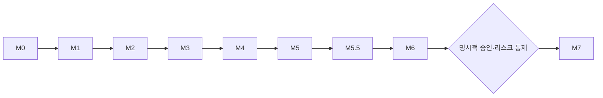

# 마일스톤 개발 계획

각 단계는 독립적으로 실행 가능한 결과와 `docs/tasks/`의 검증 체크리스트를 남깁니다.

| 단계 | 목표 | 실제 상태 |
|------|------|-----------|
| M0 | 무료 키와 실행 환경 | 완료 |
| M1 | 경제 일정 MVP | 완료 |
| M2 | 국내·미국 데이터 수집 | 부분 완료 — ECOS·FRED·Yahoo 완료, KRX 전 종목 수집 구현·서비스 승인 대기 |
| M3 | 지표·시장·분석 대시보드 | 완료 |
| M4 | REST·pi·표준 MCP | 완료 |
| M5 | 주요국 모니터링 | 부분 완료 — FRED/Yahoo proxy 완료, ECB·BOJ·Eurostat 직접 연동 대기 |
| M5.5 | 신뢰성·정확성 개선 | 완료 |
| M6 | 신호·브리핑·포지션 기반 투자 보조 | 부분 진행 — 155개 계열과 공용 파생 시장진단 기반 구현 |
| M7 | 주문·리스크 규칙·백테스트 | 대기 |

## 단계별 완료 조건

### M0 — 준비

ECOS·FRED·KRX 키를 안전하게 보관하고 `uv sync` 및 기본 프로젝트 구조가 동작합니다.

### M1 — 경제 일정 MVP

공식 출처 일정이 KST로 변환되어 웹과 API에 보이고, 원문 날짜·시간대·URL을 추적할 수 있습니다.

### M2 — 데이터 소스 연결

ECOS·FRED의 주기별 계열과 시장 시세가 SQLite에 자동 저장됩니다. KRX는 시장별 전 종목 배치 수집과 자동 유니버스가 구현됐으며, 서비스별 승인 후 운영 데이터 적재와 Yahoo 교차 검증을 완료 조건으로 유지합니다.

### M3 — 대시보드

지표, 관심 종목, 지수, 상관, 연결성, 수집 상태를 브라우저에서 탐색할 수 있습니다.

### M4 — 에이전트 인터페이스

REST, 프로젝트 로컬 pi 도구, 표준 MCP stdio 도구가 같은 캐시를 읽고 실제 호출로 검증됩니다.

### M5 — 주요국

한국·미국·유럽·일본·중국·영국을 한 화면에서 비교합니다. proxy 계열과 각국 공식 원천 계열을 구분해 표시합니다.

### M5.5 — 신뢰성·정확성

날짜·시간대·출처, DB 마이그레이션·빈티지, 영속 스케줄, cache-only API, 분석 수학, 오류 처리, 테스트·백업·운영 문서를 보강합니다. 최신 자료는 1차 reconciliation, 과거 자료는 공급자 manifest 기반 2차 유한 복구로 방어합니다. 상세는 [historical-recovery.md](historical-recovery.md)를 참고합니다.

### M6 — 투자 보조

알림 규칙은 관측일·수집시각·공식/proxy·근거·한계를 포함하고, 과거 데이터로 오탐과 데이터 누출을 검증합니다. 한국 경기·수출·반도체와 미국 금융여건·실질금리·시장폭 입력 및 공용 파생지표는 구현됐으며 브리핑 조합이 남았습니다. 자동 주문 권한은 없습니다.

방향과 하위 단계(M6.1 정규화 엔진 · M6.2 학습 구조 · M6.3 파생 계열 승격 · M6.4 브리핑)는 [decision-support.md](decision-support.md)에 있습니다. 숙련자용 정확도와 초보자용 학습 구조를 한 화면에서 함께 만족시키는 것이 이 단계의 핵심 설계 제약입니다.

### M7 — 투자 수행

백테스트, 주문 전 승인, 손실 한도, kill switch, 감사 로그가 모두 갖춰진 뒤 별도 명시적 승인으로 진행합니다.

## 순서

