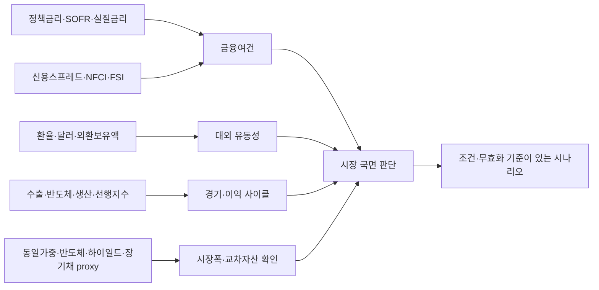

# 분석 입력 데이터 커버리지 강화

상태: **완료** (2026-08-29) — 현 소스 2차 확장·파생진단·브라우저 검증에 더해 KRX 31개 서비스 전량 승인·수집

## 목표

지표 수를 무작정 늘리는 것이 아니라 다음 질문에 답할 수 있는 근거를 확보합니다.

- 위험선호가 유지되는가, 금융여건이 갑자기 긴축되는가?
- 주가 하락이 할인율·신용·달러·실물경기 중 어디에서 왔는가?
- 한국 시장의 움직임이 반도체 수출·경기순환·환율과 일치하는가?
- 상승이 일부 대형주에 집중됐는지 시장 전반으로 확산됐는가?
- 분석에 쓴 값이 언제 관측됐고 언제 수집됐으며 공식 통계인지 proxy인지?

## 1차: 지금 추가한 저부담 계열

기존 84개에 40개를 추가해 총 124개입니다. 초기 적재 예상은 약 6,800행이며, 기본 스케줄 기준 추가 외부 호출은 약 76회/일입니다. 틱·분봉을 수집하지 않으므로 현재 SQLite 규모와 직렬 수집 구조에서 부담이 작습니다.

| 공급자 | 추가 | 주기 | 분석 기여 | 예상 추가 호출 |
|--------|-----:|------|-----------|---------------:|
| ECOS | 26개 | 월간 | 한국 경기·시장·수출·반도체·대외건전성 | 약 26회/일 |
| FRED | 10개 | 일간 4, 주간 4, 월간 2 | 실질금리·기대물가·달러 유동성·금융스트레스·경기 | 약 34회/일 |
| Yahoo | 4개 proxy | 일간 | 시장폭·반도체·하이일드·듀레이션 교차확인 | 약 16회/일 |

### 한국 ECOS 26개

| 묶음 | 계열 |
|------|------|
| 은행 금융여건 | 예금은행 수신금리, 대출금리 |
| 시장·밸류에이션 | 코스피·코스닥 거래대금과 회전율, 코스피 PER·배당수익률 |
| 심리·경기순환 | 경제심리지수, 선행·동행지수순환변동치 |
| 생산·내수·투자 | 제조업 생산·재고·가동률, 소매판매, 설비투자 |
| 대외건전성 | 외환보유액, 증권투자 부채 |
| 수출·반도체 | 전체 수출 금액·물량, 반도체 수출 금액·물량·가격, 교역조건, DRAM·NAND 생산자물가 |

한국 M1·M2·대출·예금·가계신용은 공급자 원자료의 `십억원`, 투자자예탁금은 `원`, 주식 거래대금은 `천원`, 외환보유액은 `천달러` 단위로 카탈로그를 맞췄습니다. 값 자체를 임의 환산하지 않아 저장 이력과 단위가 일치합니다.

### 미국 FRED 10개

| 계열 | 역할 | 해석 주의 |
|------|------|-----------|
| SOFR | 달러 단기 조달비용 | 연방기금 목표범위가 아님 |
| 10년 실질금리 | 장기 실질 할인율 | TIPS 시장 기반 |
| 10년 기대인플레이션 | 시장 물가 기대 | 확정 물가 전망이 아님 |
| 광의 달러지수 | 글로벌 달러 압력 | 원/달러와 방향이 항상 같지 않음 |
| NFCI | 종합 금융여건 | 0 초과는 평균보다 긴축적 |
| St. Louis FSI | 금융스트레스 교차검증 | 0 초과는 평균보다 높은 스트레스 |
| 연준 총자산 | 중앙은행 유동성 배경 | 단독으로 주가 방향을 결정하지 않음 |
| 계속 실업수당 | 고용 악화 지속성 | 주간 변동과 계절조정 주의 |
| CFNAI | 미국 실물활동 | 0은 역사적 추세 성장 부근 |
| Sahm 지표 | 경기침체 위험 | 0.50%p는 신호이지 실시간 확정 판정이 아님 |

### Yahoo 일별 proxy 4개

| 키 | 종목 | 용도 |
|----|------|------|
| `us_equal_weight_proxy` | RSP | S&P 500 시가총액가중 대비 시장폭 |
| `us_semiconductor_proxy` | SMH | 미국 반도체 업종 방향 |
| `us_high_yield_proxy` | HYG | 신용위험 가격 방향의 보조 확인 |
| `us_long_treasury_proxy` | TLT | 장기 듀레이션 가격 방향의 보조 확인 |

모두 이름과 API 응답에 `proxy=true`를 보존합니다. 공식 지수·수익률·신용스프레드 자체로 표현하지 않습니다.

## 수집 내역 가시성 강화

스키마 v5의 `series_catalog`와 관리/API/MCP 응답에 다음 필드를 추가했습니다.

- `analysis_group`: 정책금리, 유동성, 신용스트레스, 경기, 시장폭 등 분석 역할
- `priority`: 광범위 시장 분석에서 먼저 확인할 `core`와 보조 계열
- `is_proxy` / `proxy`: 공식 계열과 거래 가능한 대용치 구분
- `source_url`: 공급자 계열 원문
- `latest_date`: 시장·경제 관측일
- `retrieved_at`: 실제 캐시 수집시각

`market_health`는 전체와 핵심 계열의 최신·지연·누락 수, 공급자별·분석그룹별 준비도를 `coverage`로 반환합니다. 관리 화면도 키만 보여주지 않고 목적·원계열·관측일·수집시각을 함께 표시합니다.

## 2026-08-25 검증 결과

- 신규 40개를 40/40 최초 적재했고, 전체 124개가 모두 관측치를 보유합니다.
- 전체 최신성은 최신 117개·공급자 지연 7개·누락 0개이며, 핵심 분석 계열은 34/34 최신입니다.
- 공급자 지연 7개는 캐시의 마지막 관측일이 FRED 공급자 최신점과 일치합니다. 계속 실업수당·Case-Shiller 주택가격은 발표 시차이고, OECD 경유 일본·중국·영국·유로 계열은 직접 무료 원천 교체 후보입니다.
- 일정·지표·관리·종목·지수·상관·전이효과 7개 화면을 실제 브라우저에서 열었습니다. 지표 카테고리 합계 124개, 지수 상세 차트, 상관 재계산, 전이효과 밀도 전환과 노드 hover가 정상이며 콘솔 오류는 없었습니다.
- 네트워크 비의존 단위 테스트 50개가 모두 통과했습니다.

## 2차: 현 소스 추가 확장과 분석 소비자

기존 소스의 미사용 계열을 먼저 활용해 31개를 더 추가했습니다. 이 단계를 마쳤을 때 카탈로그는 155개였습니다(ECOS 81·FRED 61·Yahoo 13). 현재 수치는 [`../state.md`](../state.md)를 봅니다 — M6.3에서 거래소 파생 계열이 더해져 175개입니다.

| 공급자 | 추가 | 주기 | 분석 기여 |
|--------|-----:|------|-----------|
| ECOS | 16개 | 월간 | 산업·서비스 생산, 카드소비, 건설·고용·임금, 수입물가·반도체·교역조건, 시가총액 |
| FRED | 11개 | 일·주·월·분기 | 미국 금리곡선·term premium·고용 흐름·생산·연준 유동성·은행대출태도 |
| Yahoo | 4개 proxy | 일간 | IG 회사채·지역은행·경기/필수소비재 상대강도 |

계열 추가가 조건문 증가로 이어지지 않도록 공급자 메타데이터를 정리했습니다.

- 주기는 카탈로그의 `frequency`, 정상 발표 시차는 `max_age_days`, ECOS 하위 차원 선택은 `source_options`로 저장합니다.
- ECOS 응답에서 같은 날짜가 여러 하위 차원으로 들어오면 명시적 selector 없이는 실패시킵니다. 행 순서에 따라 마지막 값이 덮어쓰이는 동작을 허용하지 않습니다.
- 한국 산업·서비스 생산과 실업률 등은 계절조정 계열, 수입·반도체 가격은 원화 기준처럼 실제 선택 조건을 provenance로 남깁니다.
- REST와 MCP/pi가 같은 `market_metrics.py`를 사용해 신용스프레드, 실질 정책금리, 순유동성, 물가 증감, NFP 증감, 교차자산 상대강도를 계산합니다.
- KRX 전 종목 표가 캐시에 들어오면 같은 서비스가 상승·하락 종목, A/D 비율, 상승/하락 거래대금, 상위 10종목 쏠림, 20일 이동평균·신고가/신저가 비중을 계산합니다. 승인 전에는 추정값 대신 unavailable 사유를 반환합니다.

공식 일정은 BEA의 GDP·PCE와 BLS의 JOLTS·PPI 확정 발표일을 보강해 39개가 됐습니다. 원문 미국 동부시각과 KST 변환값을 모두 보존합니다.

### 2차 검증 결과

- 신규 31개를 31/31 수집했고 전체 155개가 모두 관측치를 보유합니다.
- 전체 최신성은 최신 150개·공급자 지연 5개·누락 0개이며, 핵심 계열은 34/34 최신입니다.
- `/stocks` 파생진단, `/manage`의 155개·34/34 상태, 8월 26일 GDP·PCE 일정을 앱 브라우저에서 확인했고 콘솔 warning/error는 없었습니다.
- 네트워크 비의존 단위 테스트 55개와 Python compile 검사가 통과했습니다.

## 3차: 다음 우선순위

| 우선순위 | 데이터 | 분석 가치 | 비용·조건 | 상태 |
|----------|--------|-----------|-----------|------|
| P1 | KRX 전 종목 일별 표 기반 등락종목수·상승/하락 거래대금·신고가/신저가·업종 폭 | 한국 장의 실제 폭과 쏠림 | 기존 구현 재사용 | 완료 — 31개 전량 승인, `market_breadth`가 등락종목수·거래대금 쏠림 산출 |
| P1 | KRX 외국인·기관·개인 순매수 | 국내 장의 수급 원인 | 현재 승인된 31개 표에 없음, 공식 무료 원천 추가 확인 | 조사 필요 |
| P1 | OpenDART 실적·공시·컨센서스 대체 지표 | 지수 움직임과 기업이익 연결 | 무료 키·정규화·정정공시 처리 필요 | 미구현 |
| P2 | 미국 재무부 입찰·국채 발행 일정 | 장기금리 이벤트 위험 | 공식 일정, 저빈도 | 미구현 |
| P2 | CFTC COT 주간 포지션 | 달러·금리·원자재 포지셔닝 | 무료, 계약 코드 매핑 필요 | 미구현 |
| P2 | ECB·BOJ·Eurostat 직접 시계열 | FRED proxy 의존 축소 | 무료, 공급자별 파서 필요 | M5 잔여 |
| P2 | 주요 기업 실적 발표일 | 익일 갭 위험 | 공식 기업 IR 우선, 전 종목 자동화는 비용 큼 | 범위 설계 필요 |
| P3 | 뉴스·RSS·GDELT 감성 | 사건 설명력 | 중복·오탐·저작권·저장량 큼 | 기본 비활성 |
| 제외 | 틱·호가·체결 전량 | 초단기 실행 | 무료·자원 원칙과 맞지 않음 | 수집하지 않음 |

## 자원 보호 규칙

- 일·주·월 계열을 기존 cadence에 합치고 별도 고빈도 수집기를 만들지 않습니다.
- 신규 proxy는 2년 일봉만 보존하며 분봉을 요청하지 않습니다.
- 핵심 계열이 지연됐다고 전체 155개를 재수집하지 않고 결측 키만 복구합니다.
- 월간 자료는 관측월 초일부터 다음 발표까지의 시차를 고려해 100일을 허용하며, 공급자 최신점과 같은 정상 발표 지연을 결측으로 반복 호출하지 않습니다.
- 2차 과거 복구는 기존 호출 예산·최대 3회·`verified_empty`/`blocked`/`exhausted` 종료 규칙을 그대로 적용합니다.
- P2·P3는 분석 소비자와 자원 상한이 정해지기 전 자동 활성화하지 않습니다.

## 완료 조건

- [x] 신규 40개 계열이 최소 한 번 수집되고 각 공급자 최신 관측일과 대조됩니다.
- [x] `market_health.coverage.core`에서 누락·지연 원인을 구분할 수 있습니다.
- [x] proxy가 공식 통계로 잘못 표현되지 않습니다.
- [x] 관리 화면에서 관측일과 수집시각을 구분할 수 있습니다.
- [x] 단위·주기·메타데이터·cache-only 회귀 테스트가 통과합니다.
- [x] 현 소스 추가 31개와 명시적 ECOS 차원 선택이 카탈로그 provenance에 보존됩니다.
- [x] REST·MCP·pi·웹이 같은 cache-only 파생지표 계산 서비스를 사용합니다.
