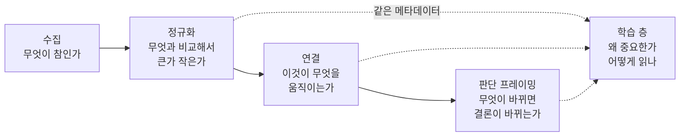

# 의사결정 지원으로의 발전 방향

> 자료를 모으는 단계에서 **판단을 보조하는 단계**로 넘어가기 위한 연구.
> 결론부터: 새로 지어야 할 것은 거의 없고, **이미 지은 것을 표면으로 꺼내는 일**이 대부분입니다.

## 1. 측정한 현재 위치

방향을 정하기 전에 지금 무엇을 가졌는지 세었습니다. 아래 숫자는 전부 2026-08-29 실측입니다.

### 강한 것 — 증거의 신뢰성 기반

이 프로젝트가 남들과 다른 지점은 데이터의 양이 아니라 **"이 숫자를 믿어도 되는가"에 답하는 구조**입니다.

- 관측일과 수집시각의 분리, 계열별 `date_kind`(거래일·달력일·기간시작)
- 결측을 세 등급(`confirmed`·`candidate`·`unverifiable`)으로 구분하는 커버리지 감사
- 공급자 manifest 기반 유한 복구 원장, 자가 치유 감사
- 임계값이 아니라 **자체 분포 백분위**로 채점하는 규율
- 이력이 부족한 구성요소는 추정하지 않고 **제외하고 사유를 남기는** 규약
- 산식·창·한계를 문자열로 공개하는 `method` / `method_note`

의사결정 지원은 이 위에서만 정직할 수 있습니다. 이 기반은 재구축 대상이 아닙니다.

### 얇은 것 — 측정된 구멍

| 분석 그룹 | 계열 수 | | 분석 그룹 | 계열 수 |
|---|---:|---|---|---:|
| policy_rates | 33 | | commodities | 7 |
| growth_cycle | 27 | | sentiment | 6 |
| fx_external | 20 | | trade_semiconductors | 5 |
| inflation | 16 | | housing | 4 |
| credit_stress | 12 | | **positioning** | **3** |
| market_breadth | 11 | | **valuation** | **2** |
| labor | 11 | | **volatility** | **1** |
| liquidity | 10 | | | |

핵심 38개 / 보조 130개. 판단에 가장 직접적인 세 층(포지셔닝·밸류에이션·변동성)이 가장 얇습니다.

### 설명 자산의 실상

| 항목 | 실측 |
|---|---|
| 지표 수 | 168 |
| 설명 보유 | 168 (100%) |
| **서로 다른 설명** | **47** |
| 자기만의 설명을 가진 지표 | 34 |
| 가장 큰 묶음 | 26개 지표가 한 문장 공유 |
| 설명 길이 중앙값 | 32자 |
| `finance-guide.md` | 109줄, **웹에서 도달 불가** |
| `analysis-methods.md` | 77줄, **웹에서 도달 불가** |

"100% 커버리지"는 사실상 **카테고리 문구 재사용**입니다. 26개 지표가 "중앙은행 기준금리와 시장금리. 금리 상승은 주식에 부정적, 하락은 긍정적."이라는 한 줄을 공유합니다. 초보자가 `kr_kofr`와 `kr_cd_91d`의 차이를 여기서 배울 수는 없습니다.

그리고 **가르치는 글은 이미 186줄 존재하는데 숫자가 있는 화면에서 닿을 수 없습니다.** 이것이 학습 구조의 가장 큰 단일 결함입니다.

## 2. 방향 — 세 개의 층

수집은 "무엇이 참인가"에 답합니다. 판단 보조는 그 위에 세 질문이 더 필요합니다.



**정규화**는 이미 두 곳에 구현돼 있습니다 — `analysis.py`의 `_risk_on_percentile`과 `sentiment.py`의 `_percentile_score`. 같은 개념의 두 구현이고, 어느 타일에서도 부를 수 있는 하나로 합쳐야 합니다. 합치고 나면 **모든 지표가 "자기 분포에서 몇 점"을 가질 수 있습니다.** 지금은 국면 분류기와 심리 게이지 안에서만 그렇습니다.

**연결**은 카탈로그가 이미 절반을 갖고 있습니다. `analysis_group`이 계열을 층으로 묶고 있지만, 층 사이의 관계는 어디에도 없습니다. 필요한 것은 무거운 인과 모델이 아니라 **"이 지표가 움직이면 어느 층을 확인해야 하는가"**라는 얕은 링크입니다.

**판단 프레이밍**의 씨앗은 이미 있습니다 — 한국/미국 국면이 갈릴 때 뜨는 불일치 배너. 그것을 일반화하면 됩니다: 구성요소가 반대로 투표할 때, 판정이 임계에 가까울 때, 근거 하나가 pending일 때.

## 3. 학습 구조 — 가장 중요한 부분

### 원칙: 하나의 화면, 두 독자, 진실은 하나

숙련 애널리스트용 화면과 초보자용 화면을 따로 만들면 두 개가 어긋납니다. 대신 **같은 타일을 펼치는 깊이**로 나눕니다.

| 깊이 | 보이는 것 | 독자 |
|---|---|---|
| 0 (기본) | 값 · 관측일 · 자체 분포 백분위 | 애널리스트는 여기서 끝 |
| 1 | 왜 중요한가 (2~3문장) | 이 지표를 처음 보는 사람 |
| 2 | 어떻게 읽나 — 높으면/낮으면, 함께 볼 지표 | 배우는 중 |
| 3 | **지금 값의 뜻** (생성) | 모두 |
| 4 | 산식 · 창 · 출처 · 한계 | 검증하려는 사람 |

### 아키텍처 주장: 설명은 템플릿이 아니라 카탈로그에 산다

이 프로젝트가 반복해서 배운 교훈이 있습니다 — 스프레드 정의는 한 곳(`aligned_spread_series`), 파생 dispatch도 한 곳(`derive_aggregate_points`). **가르치는 메타데이터와 분석을 구동하는 메타데이터가 같은 객체가 아니면 반드시 어긋납니다.**

따라서 설명은 `series_catalog`에 `date_kind`·`max_age_days` 옆에 구조화된 필드로 들어갑니다:

```
what        이 숫자가 무엇인지 (한 문장)
why         왜 보는지 — 무엇을 알려주는 신호인지
how         읽는 법 — 높을 때/낮을 때, 함께 볼 계열
watch       이 값이 어디를 넘으면 다른 층을 확인해야 하는지
caveat      이 계열 고유의 함정
```

- **핵심 38개는 손으로 작성**합니다. 이것이 이 작업의 실제 비용이고, 다른 무엇보다 가치가 큽니다.
- 보조 130개는 카테고리 fallback을 유지하되, **fallback임을 화면에 표시**합니다. "이 설명은 이 지표 고유가 아니라 금리 계열 공통 설명입니다"라고 밝히는 편이 32자 문구를 지표별 설명인 척하는 것보다 정직합니다.

### 차별점: "지금 값의 뜻"은 생성됩니다

정적 설명은 CPI가 무엇인지 말합니다. 이 시스템은 **지금 이 값이 무엇인지** 말할 수 있습니다. 백분위 엔진이 이미 있기 때문입니다.

> VKOSPI **56.29** — 3년 분포 상위 **86%**. 중앙값은 21.23이고, 이 수준은 2026년 6~8월 구간 외에는 나타나지 않았습니다. *(관측일 2026-08-25 · 출처 KRX)*

이 한 문장이 애널리스트에게는 위치 정보이고 초보자에게는 학습 재료입니다. 요청 시점에 LLM이 쓰는 게 아니라, **카탈로그의 설명 템플릿에 현재 값·백분위·관측일을 끼워 넣는 결정론적 생성**입니다. 재현 가능하고 캐시 가능하며 틀릴 여지가 없습니다.

### 배치

- **모든 숫자 옆에 `?`** — 클릭하면 깊이 1~4가 펼쳐집니다. 페이지 이동 없음.
- **`/learn`** — `finance-guide.md`·`analysis-methods.md`를 웹으로 올리고, 각 항목에서 실제 계열로 링크. 지금은 이 글들이 저장소 안에만 있습니다.
- **용어 사전** — 화면 어디서든 같은 팝오버. 카탈로그가 원본.

## 4. 내부 아키텍처 — 재구축은 거의 필요 없습니다

정직하게: SQLite 단일 저장소, cache-only 읽기, 수집기/감사 이층 구조는 이 방향에서 **그대로 살아남습니다**. 서버 렌더 + 최소 JS도 유지합니다.

실제로 필요한 변경은 셋입니다.

1. **정규화 엔진 추출** — `analysis.py`와 `sentiment.py`에 중복된 백분위 계산을 한 모듈로. 창(trailing/full) 선택 근거도 여기에 문서화합니다. 이미 배운 것: 계열의 성질이 창을 정합니다(스프레드는 드리프트, 변동성·낙폭은 평균회귀).
2. **카탈로그 설명 필드** — 스키마 확장 + 로더. 마이그레이션은 기존 패턴대로.
3. **파생 계열 승격 경로** — `derive_aggregate_points`는 이미 있습니다. KRX 표에서 지표를 끌어올리는 자리가 이미 마련돼 있고, 저장된 행에서 재구축까지 됩니다. 5절의 제안은 전부 이 경로를 씁니다.

### 하지 않을 것

| 거부 | 이유 |
|---|---|
| 마이크로서비스 · 이벤트 스트림 | 개인용 단일 저장소에 운영 복잡도만 추가 |
| JS 프레임워크 이전 | 현재 화면이 서버 렌더로 충분히 동작 |
| 요청 시점 LLM 설명 생성 | 재현 불가·검증 불가. 설명은 검토된 자산이어야 함 |
| 시계열 DB 도입 | 168계열 × 20년은 SQLite가 여유 있게 처리 |
| 실시간·틱 데이터 | 무료 원칙 |

## 5. 수집 항목 추가 — 대부분 이미 받고 있습니다

가장 중요한 발견입니다. KRX 31개 표를 이미 수집·저장하고 있지만, 지표 계열로 끌어올린 것은 **VKOSPI와 풋/콜 3종, 단 4개**뿐입니다. 얇은 세 층은 **새 공급자 없이** 채울 수 있습니다.

아래는 전부 2026-08-25 저장 행으로 실제 계산해 본 것입니다.

| 제안 | 원천 (이미 저장 중) | 실측 검증값 | 채우는 층 | 비용 |
|---|---|---|---|---|
| **한국 10년 기대인플레이션** | `kts_bydd_trd` 지표종목 | 국고 4.322% − 물가채 1.72% = **2.60%p** | inflation (한국은 전부 후행) | 파생만 |
| 코스피200 선물 미결제약정 | `fut_bydd_trd` `ACC_OPNINT_QTY` | **166,659 계약** | **positioning (3)** | 파생만 |
| ETF 괴리율 분포 | `etf_bydd_trd` 가격 vs `NAV` | 1,164종, 중앙값 +0.004%, 하위5% −0.74% | credit_stress·liquidity | 파생만 |
| ETF 순자산 총액 | `etf_bydd_trd` | **446.8조원** | liquidity (자금 흐름 proxy) | 파생만 |
| 채권지수 듀레이션·평균수익률 | `bon_dd_trd` | 듀레이션 4.817, 평균수익률 4.082% | **valuation (2)** · 금리위험 | 파생만 |
| 국채 곡선 교차검증 | `kts_bydd_trd` 지표종목 | 2·3·5·10·20·30년 거래소 종가수익률 | 로드맵 1번(공급자 이중화) | 파생만 |
| KRX 금 국내가 | `gold_bydd_trd` | 208,300원/g → 국제 금 대비 국내 프리미엄 | commodities·fx_external | 파생만 |

**기대인플레이션이 특히 중요합니다.** 현재 inflation 그룹 16개 중 한국 계열 9개는 전부 실현 물가(후행)이고, 시장이 *앞으로* 무엇을 예상하는지 알려주는 계열이 한국에는 없습니다. 미국은 `us_breakeven_10y`와 `us_forward_inflation_5y5y`를 갖고 있습니다. 만기가 정확히 일치하는 국고/물가채 쌍(2036-06)이 이미 저장돼 있어 계산이 깔끔합니다.

### 주의: 함정이 하나 있습니다

`kts_bydd_trd`의 만기 구분은 **원발행 만기**이고 잔존만기가 아닙니다. 전체 중앙값을 쓰면 10년 구간이 3.44%로 나오는데, 이는 잔존 1년짜리 경과종목이 섞였기 때문입니다. `GOVBND_ISU_TP_NM == "지표"`(on-the-run)로 걸러야 4.322%가 나옵니다. 이 프로젝트의 규율대로, **파생 정의에 이 필터를 명시적으로 적고 테스트로 고정**해야 합니다.

### KRX 추가 신청 — 없습니다

2026-08-29 공식 서비스 목록과 대조한 결과, **KRX Open API가 제공하는 전체 서비스는 31개이고 그 31개가 이미 전부 승인·수집 중입니다.**

| 카테고리 | 공식 제공 | 우리 승인 |
|---|---:|---:|
| 지수 | 5 | 5 |
| 주식 | 8 | 8 |
| 채권 | 3 | 3 |
| 파생상품 | 6 | 6 |
| 증권상품 | 3 | 3 |
| 일반상품 | 3 | 3 |
| ESG | 3 | 3 |
| **합계** | **31** | **31** |

원장 확인: `krx_access` 31건 전부 `complete`, 차단 0건, 31개 전부 실제 행 수신 중.

**따라서 KRX 쪽에서 신청으로 더 얻을 수 있는 것은 없습니다.** 한국 시장의 증거를 더 두껍게 하는 길은 신규 승인이 아니라 **이미 받는 표에서 파생을 끌어올리는 것**뿐이고, 그것이 위 표의 제안입니다.

### 구조적으로 얻을 수 없는 것

- **투자자별 매매동향(외국인·기관 수급)** — 한국 시장 판단의 핵심 입력이지만 **KRX Open API 카탈로그에 존재하지 않습니다.** 승인 문제가 아니라 제공 범위 밖입니다. 공식 API가 아닌 경로(화면 스크래핑 등)는 이 프로젝트의 출처 원칙과 `lessons.md` 1번(스크래핑 원천은 예고 없이 막힌다)에 어긋나므로 **보류**합니다. 다른 무료 공식 공급자를 찾는 것은 별도 조사 과제입니다.
- **공매도 잔고 · 시가총액 계열 · 외국인 보유 비중** — 같은 이유로 Open API 범위 밖입니다.
- **기업 실적·재무제표** — 새로운 공급자 계열이고 사실상 다른 시스템이므로 제외합니다.

## 6. 메뉴·대시보드

현재 8그룹 12화면은 질문 단위로 잘 재편돼 있습니다. 구조를 갈아엎기보다 **두 개를 더하고 하나를 고칩니다.**

| 변경 | 내용 |
|---|---|
| **추가 `/learn`** | 저장소에만 있는 금융 가이드·분석 방법론을 웹으로. 각 항목에서 실제 계열로 링크 |
| **추가 `/brief`** | M6의 브리핑. 오늘 무엇이 바뀌었고, 무엇이 서로 어긋나며, 무엇이 pending인지. 관측일·근거 링크 포함, 매수/매도 없음 |
| **고침: 상황판** | 모든 타일에 `?` 진입점. 백분위를 값 옆에 상시 표시 |

`/brief`가 판단 프레이밍의 집입니다. 형태는 이미 검증된 패턴을 씁니다 — 구성요소가 투표하고, 불일치를 드러내고, pending을 밝히고, 산식을 공개합니다.

## 7. 단계

기존 M6 안에서 진행합니다. 새 번호 체계를 만들지 않습니다.

| 단계 | 내용 | 선행 | 상태 |
|---|---|---|---|
| **M6.1** | 정규화 엔진 추출. 모든 타일이 백분위를 가짐 | 없음 | **완료 (2026-08-29)** |
| **M6.2** | 카탈로그 설명 필드 + 핵심 38개 작성 + `?` 진입점 + `/learn` | M6.1 (깊이 3이 백분위 필요) | 대기 |
| **M6.3** | 파생 계열 승격 — 기대인플레이션 우선, 이어서 포지셔닝·괴리율·듀레이션 | 없음 (병렬 가능) | 대기 |
| **M6.4** | `/brief` — 불일치·watch 조건·근거 링크 | M6.1~M6.3 | 대기 |

가장 값싸고 가장 효과가 큰 것부터: **M6.3의 기대인플레이션**은 파생 하나로 한국 물가 판단에 없던 축을 만듭니다. **M6.2의 핵심 38개 설명**은 손이 가장 많이 가지만 학습 구조 전체를 여는 열쇠입니다.

## 8. 경계 — M7 게이트 안에 머뭅니다

이 대시보드는 **무엇이 보이는가**와 **무엇이 바뀌면 판단이 바뀌는가**에 답합니다. 매수·매도를 말하지 않습니다.

- 판정은 참고 분류이고 각자의 산식·창·한계를 공개합니다
- 상관·전이는 서술 통계이며 예측력이나 인과가 아닙니다
- watch 조건은 "이 결론을 뒤집으려면 무엇이 필요한가"이지 진입·청산 신호가 아닙니다
- 자동 주문은 M7의 백테스트·승인·손실한도·kill switch·감사로그 이전에는 없습니다

이 경계는 `SKILL.md`의 해석 가드레일과 같은 계약이고, 화면도 같은 계약을 지킵니다.

## 9. 한 문장 요약

> 새로 지을 것은 거의 없습니다. **백분위 엔진을 꺼내 모든 타일에 붙이고, 설명을 카탈로그에 넣어 숫자 옆에서 펼치고, 이미 저장 중인 KRX 표에서 얇은 층을 채우면** — 애널리스트에게는 더 정확해지고 초보자에게는 배울 수 있는 화면이 됩니다.
