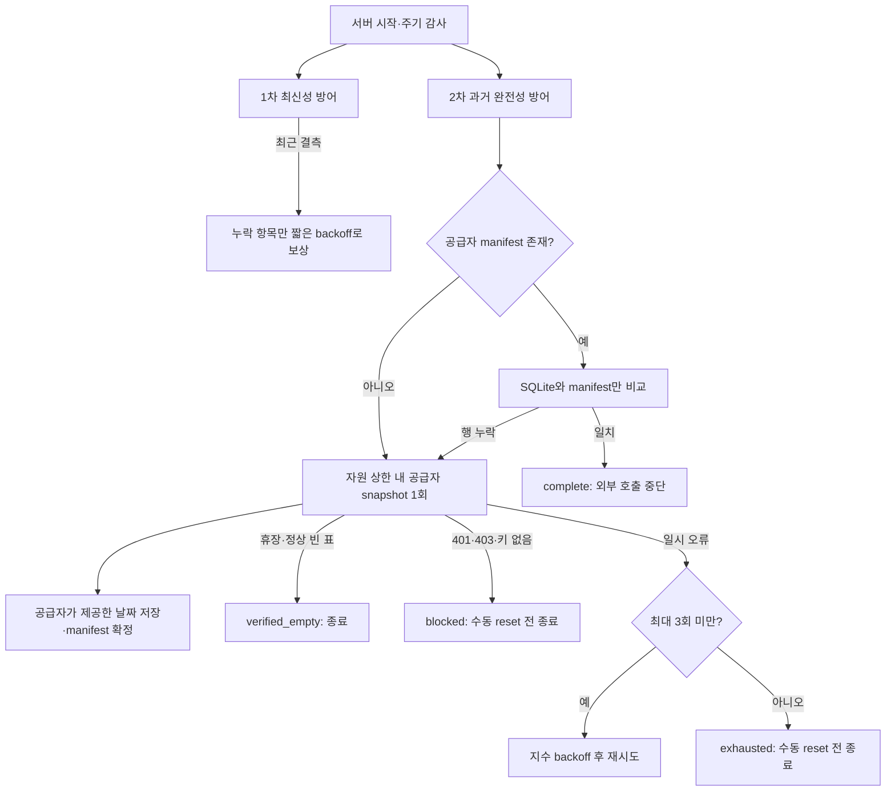

# 2단계 결측 방어 계획

상태: **구현 완료** (2026-08-25)

목표는 최신 자료의 짧은 공백과 과거 시계열 내부의 공백을 서로 다른 정책으로 복구하면서, 공급자에게도 존재하지 않는 자료를 무한히 요청하지 않는 것입니다.

## 1차 방어

- 시작 직후와 5분마다 SQLite 최신성·결측을 감사합니다.
- 일정, 지표 최신일, 관심 종목·지수 현재가, 지수 최근 이력, KRX 최근 5영업일을 검사합니다.
- 실제 결측 항목만 재수집하며 정상 결측은 최대 1시간, 공급자 오류는 최대 6시간 backoff를 적용합니다.
- KRX 데이터셋별 401은 2차 방어의 권한 gate에 `blocked`로 기록하여 이후 두 방어선 모두 외부 호출을 중단합니다.

## 2차 방어

- 지표는 각 수집기가 제공하는 전체 snapshot(FRED·ECOS 기본 3년, Yahoo 상품 2년)을 한 번 대조합니다.
- 글로벌 지수는 각 심볼의 최대 20년 일별 snapshot을 대조합니다.
- KRX는 활성 scope의 각 데이터셋에 대해 시작 시점의 최근 20영업일을 고정 세대로 구성합니다. 이후 새 거래일은 1차 방어가 담당하므로 과거 큐가 계속 커지지 않습니다.
- 공급자가 실제로 반환한 관측일 목록을 `recovery_ledger.manifest_json`에 저장합니다. 거래소별 휴일이나 계열별 비정기 관측일을 임의 달력으로 추정하지 않습니다.
- 이후 감사는 manifest와 SQLite만 비교합니다. 일치하면 공급자를 다시 호출하지 않고, SQLite에서 실제 행이 사라진 경우에만 해당 대상을 재활성화합니다.

## 유한 종료 보장

| 상태 | 의미 | 자동 공급자 재시도 |
|------|------|--------------------|
| `complete` | 공급자 manifest가 SQLite에 모두 존재 | 없음 |
| `verified_empty` | KRX 휴장 등 공급자가 빈 표를 정상 반환 | 없음 |
| `retryable` | 일시 오류이며 시도 한도 미도달 | 지수 backoff 후 재시도 |
| `blocked` | 인증키·서비스 승인 문제 | 없음 |
| `exhausted` | 최대 3회 실패 또는 빈 전체 시계열 2회 확인 | 없음 |

`blocked`와 `exhausted`는 API·관리 화면에 남지만 자동 호출 대상에서는 제외됩니다. 인증·계열 식별자·정책을 수정한 뒤 `--history-reset`으로 명시적으로 다시 활성화하거나, 키/소스 fingerprint가 바뀌면 자동으로 새 세대로 전환됩니다.

## 자원 상한

- 기본 실행 간격: 6시간
- 실행당 지표 6개, 지수 3개, KRX 일별 표 3개
- KRX 2차 실행당 최대 200,000행
- 대상별 최대 3회, 빈 전체 시계열은 2회 확인 후 종료
- 모든 실행은 기존 scheduler 단일 lock 안에서 직렬 처리

과거 복구의 “완전”은 현재 무료 공급자와 설정된 보존 범위가 실제 반환한 관측일 전체를 뜻합니다. 공급자에게 존재하지 않는 값을 보간하거나 다른 계열로 몰래 대체하지 않습니다.

