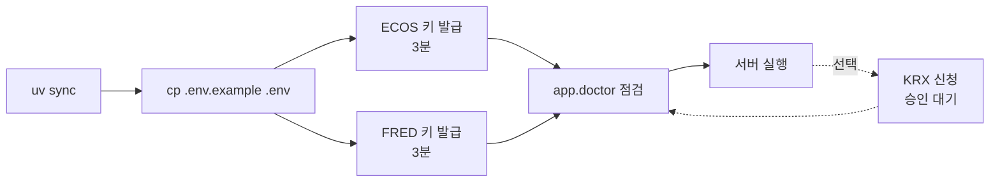

# 처음 설정하기

이 문서만 따라 하면 됩니다. **필수 소요 시간 약 10분**이고, 그중 대부분은 두 사이트에서 키를 받는 시간입니다.



---

## 1단계 — 저장소 준비 (1분)

```bash
uv sync
cp .env.example .env
```

`.env`는 `.gitignore`에 있어 커밋되지 않습니다. 키는 여기에만 두세요.

---

## 2단계 — 한국은행 ECOS 키 (필수, 약 3분)

한국 금리·환율·물가·통화·성장 계열 **89개**를 담당합니다. 이 프로젝트의 중심 데이터입니다.

1. <https://ecos.bok.or.kr/> 접속
2. 상단 **오픈API** 메뉴 → **인증키 신청**
3. 이메일·이용 목적 입력 후 신청 → **즉시 발급**됩니다 (심사 없음)
4. 발급된 키를 `.env`의 `ECOS_API_KEY=` 뒤에 붙여넣기

> 개인 연구·비상업 목적이면 별도 심사 없이 바로 나옵니다.

---

## 3단계 — FRED 키 (필수, 약 3분)

미국과 주요국 거시계열 **59개** — 금리곡선, 실질금리, 기대인플레이션, 신용스프레드, 연준 유동성을 담당합니다.

1. <https://fredaccount.stlouisfed.org/apikeys> 접속
2. 계정이 없으면 **Create New Account** (이메일 인증만)
3. 로그인 후 **Request API Key** → 사용 목적 한 줄 입력
4. **32자 소문자+숫자** 키가 즉시 발급됩니다
5. `.env`의 `FRED_API_KEY=` 뒤에 붙여넣기

---

## 4단계 — 점검 (30초)

```bash
uv run python -m app.doctor
```

키를 실제로 호출해서 동작 여부를 확인합니다. 이런 식으로 나옵니다:

```
── 필수 ────────────────────────────────
✅ 한국은행 ECOS      정상 (시장금리 표 조회 성공)
✅ FRED           정상 (DGS10 조회 성공)

── 인증 불필요 ─────────────────────────
✅ Yahoo Finance    정상 (인증 불필요)
✅ ECB Data Portal  정상 (인증 불필요)
✅ Bank of England  정상 (인증 불필요)
```

문제가 있으면 무엇을 어떻게 고칠지 함께 출력합니다. **키를 바꿀 때마다 이 명령으로 확인하세요.**

Yahoo·ECB·BoE는 키가 필요 없어 별도 준비할 것이 없습니다.

---

## 5단계 — 실행

```bash
uv run uvicorn app.main:app --host 127.0.0.1 --port 8077
```

<http://127.0.0.1:8077> 을 열면 시장 상황판이 나옵니다. 수집은 서버가 뜨면 자동으로 시작되며, 첫 전체 수집에 **약 5~10분** 걸립니다.

수집이 도는 동안 화면은 비어 보일 수 있습니다. 진행 상황은 `/manage`에서 확인하세요.

---

## 선택 — KRX Open API

**없어도 됩니다.** 국내 지수·ETF·종목 시세는 Yahoo로 들어오고, 상황판·지표·상관·전이효과가 전부 정상 동작합니다.

KRX가 추가로 주는 것은 하나입니다 — **국내 시장폭**: 등락종목수, 상승/하락 거래대금 비율, 상위 10종목 쏠림도, 20일 이동평균선 위 종목 비중, 신고가·신저가 개수.

### 키 발급

1. <https://openapi.krx.co.kr/> 가입 후 **인증키 신청**
2. `.env`의 `KRX_API_KEY=`에 입력

### ★ 서비스별 이용 신청 (여기서 대부분 막힙니다)

KRX는 **키 발급과 서비스 이용 승인이 별개**입니다. 키가 있어도 데이터셋마다 따로 신청해야 하고, 승인 전에는 `HTTP 401`이 돌아옵니다.

포털의 **서비스별 이용 신청**에서 아래 2개만 신청하면 시장폭이 완성됩니다.

| 신청할 서비스 | 코드 | 무엇이 켜지나 |
|---------------|------|---------------|
| 유가증권 일별매매정보 | `sto/stk_bydd_trd` | KOSPI 시장폭 (약 940종목) |
| 코스닥 일별매매정보 | `sto/ksq_bydd_trd` | KOSDAQ 시장폭 (약 1,800종목) |
| 옵션 일별매매정보 (주식옵션外) | `drv/opt_bydd_trd` | 시장 심리 게이지의 풋/콜 비율 |

옵션은 하루 약 9,000행(3.9MB)이 들어와 연 1.0GB가 쌓입니다. 용량이 부담되면 `KRX_MARKET_SCOPE=light`로 제외할 수 있습니다.

**혼동 주의**: 목록에 이름이 비슷한 서비스가 둘 있습니다.

- ⭕ `sto/stk_bydd_trd` **유가증권 일별매매정보** — 종목별 데이터. 시장폭에 필요한 것.
- ❌ `idx/kospi_dd_trd` **KOSPI 시리즈 지수** — 지수 값만. 시장폭에 쓸 수 없음.

카테고리가 **주식(sto)** 인지 확인하세요.

옵션도 마찬가지입니다.

- ⭕ `drv/opt_bydd_trd` **옵션 일별매매정보 (주식옵션外)** — 코스피200 지수옵션. 풋/콜 비율에 쓰는 것.
- ❌ `drv/eqsop_bydd_trd` / `drv/eqkop_bydd_trd` **주식옵션** — 개별 종목 옵션. 거래가 얇아 심리 지표로 쓰지 않습니다.

### 있으면 좋은 것 (선택)

| 서비스 | 코드 | 용도 |
|--------|------|------|
| ETF 일별매매정보 | `etp/etf_bydd_trd` | 연금 ETF를 Yahoo 대신 공식 종가로 |
| 유가증권 기본정보 | `sto/stk_isu_base_info` | 업종 분류 (업종별 시장폭 확장 시) |

### 파생 계열을 켜는 서비스

M6.3에서 거래소 표 자체를 지표 계열로 승격했기 때문에, 아래 표들은 이제 **각각 분석 입력을 하나씩 켭니다.** 승인받으면 DB만 커지는 것이 아니라 얇은 증거 층이 채워집니다.

| 서비스 | 켜지는 계열 |
|--------|-------------|
| `bon/kts_bydd_trd` 국채전문유통시장 | **한국 10년 기대인플레이션**(핵심 계열), 국고채 20년 |
| `drv/fut_bydd_trd` 선물 | 코스피200 선물 미결제약정·베이시스 |
| `idx/drvprod_dd_trd` 파생상품지수 | VKOSPI |
| `idx/bon_dd_trd` 채권지수 | 채권지수 평균 듀레이션 |
| `etp/etf_bydd_trd` ETF | ETF 할인 폭(하위 5%), 국내 ETF 공식 종가 |
| `gen/gold_bydd_trd` 금시장 | KRX 금 국내가 |
| `drv/opt_bydd_trd` 옵션 | 코스피200 풋/콜 비율 3종 |

기대인플레이션이 특히 큽니다. 한국 물가 계열 아홉 개가 전부 이미 일어난 물가를 알려주는데, 이것만이 시장이 앞을 어떻게 보는지 말해 줍니다.

### 나머지

코넥스, ELW, 개별 주식선물·옵션, ESG 정보 표는 아직 소비하는 분석이 없습니다. 자동 유니버스에는 들어오므로 종목 검색에는 쓰이지만, 파생 계열을 만들지는 않습니다.

### 승인 후

```bash
uv run python -m app.doctor                                        # 승인 확인
uv run python -m app.collect --history-reset --history-kind krx_access
uv run python -m app.collect --job krx_market
```

401은 무한 재시도를 막으려고 `blocked` 상태로 고정됩니다. 승인 후 위의 `--history-reset`으로 한 번 풀어줘야 다시 시도합니다.

20일 지표(이동평균선 위 비중, 신고가·신저가)는 종목별로 20거래일치가 쌓여야 나오므로, 신규 승인 직후에는 `0/0`으로 표시되고 **약 4주 뒤** 자연히 채워집니다.

---

## 문제가 생기면

| 증상 | 확인 |
|------|------|
| 화면이 비어 있음 | 첫 수집 진행 중일 수 있습니다. `/manage` 또는 `curl localhost:8077/api/health` |
| 특정 지표만 안 나옴 | `curl localhost:8077/api/coverage` — 결측이 `confirmed`(수집 실패)인지 `candidate`(미발표)인지 알려줍니다 |
| 키를 바꿨는데 반영 안 됨 | 서버 재시작이 필요합니다. `.env`는 기동 시 한 번만 읽습니다 |
| KRX만 401 | 서비스별 이용 신청이 승인됐는지 확인 후 `--history-reset --history-kind krx_access` |
| `/api/health`가 `degraded` | 미승인 KRX 데이터셋이 남아 있으면 정상입니다. `completeness.status`가 `ok`면 데이터는 온전합니다 |

더 깊은 내용은 [`../state.md`](../state.md)(현재 상태와 한계), [`README.md`](README.md)(소스별 특성), [`../architecture/operations.md`](../architecture/operations.md)(운영)를 보세요.
