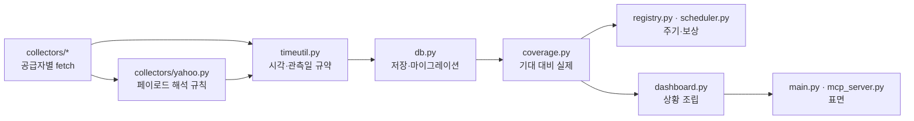

# 시스템 현재 상태

> 마지막 갱신: 2026-08-26. 데이터 수치는 운영 SQLite를 재수집한 직후 기준입니다.

## 구현 상태

| 영역 | 현재 상태 |
|------|-----------|
| 저장소 | SQLite schema v8, WAL, busy timeout, 무결성 검사, 멱등 마이그레이션, 계열별 날짜 의미(`date_kind`), 공급자 정산 세션(`session_date`), 과거 복구 ledger |
| 지표 | 168개 카탈로그 및 시계열(ECOS 81·ECOS 원표 8·FRED 59·Yahoo 13·KRX 파생 4·BoE 2·ECB 1), 분석 그룹·우선순위·proxy·원문 URL, 계열별 날짜 의미, 변경값 빈티지 보존 |
| 시장 데이터 | 글로벌 지수 24개 최대 20년 이력, 관심 종목 34개, KRX 승인 8개 데이터셋 4,387종목 자동 유니버스·일별 배치 수집 |
| 일정 | 2026년 공식 발표 일정 39개, 원문 날짜·시간·시간대·URL과 KST 변환값 저장 |
| 웹/API | 12개 웹 화면(질문 단위 8개 그룹 네비게이션), cache-only REST API, 파생 시장진단·KRX 시장폭, 로컬 ECharts 5.6.0 |
| 에이전트 | 표준 MCP·pi 확장 각 21개 도구(상황판·커버리지·심리 게이지·KRX 표 조회 포함), 프로젝트 전용 해석 스킬 |
| 운영 | 비차단 ASGI 시작, 1차 최신성 보상, 2차 manifest 과거 복구·유한 종료, SQLite 일관성 백업 |
| 검증 | 네트워크 비의존 단위 테스트 180개, 시간 규약·커버리지 감사·상황판·심리 게이지·백업 보존·웹 도달성·pi/MCP 표면 동기화 회귀 |

현재 DB에는 지표 관측치 38,192개와 지수 일별 관측치 118,405개가 있습니다. 공급자 재수집 시 값은 달라질 수 있습니다. 155개 지표 모두 관측치가 있으며, 핵심 34개는 34개 모두 최신입니다. 전체 최신성은 최신 150개·공급자 지연 5개·누락 0개입니다.

공급자 지연 5개는 로컬 수집 누락이 아니라 일본·중국·영국·유로 지역의 OECD 경유 FRED 계열이 공급자에서도 오래 갱신되지 않은 경우입니다. 직접 공식 무료 원천으로 교체할 후보로 남겨두고, 정상 발표 시차가 있는 계열은 카탈로그의 `max_age_days`로 표현해 결측 복구가 같은 값을 반복 요청하지 않게 했습니다.

## 데이터 소스

| 소스 | 용도 | 인증 | 운영상 한계 |
|------|------|------|-------------|
| ECOS | 한국 금리·환율·물가·통화·성장 | `ECOS_API_KEY` | 발표 주기가 서로 다름 |
| ECOS 원표 (817Y002) | KOFR·CP·통안증권·국고채 1~30년·회사채 BBB- | `ECOS_API_KEY` | pyecos 큐레이션에 없어 표·항목 코드로 직접 조회 |
| ECB Data Portal | 유로존 EURIBOR 등 | 없음 | 무인증 SDMX-JSON |
| Bank of England IADB | 영국 Bank Rate·SONIA | 없음 | 무인증 CSV |
| FRED | 미국 및 일부 주요국 거시지표 | `FRED_API_KEY` | 실효금리와 정책 목표금리를 구분해야 함 |
| KRX Open API | 국내 지수·주식·ETF/ETN·일반상품 전 종목 일별 표 | `KRX_API_KEY` 및 서비스별 승인 | EOD, 데이터셋별 신청 필요, 기본 행 수 상한 적용 |
| Yahoo Finance | 글로벌 주식·ETF·지수·상품 | 없음 | 비공식 엔드포인트, rate limit·심볼 폐지 가능 |
| 중앙은행·통계기관 공식 달력 | 정책회의와 미국 주요 발표 | 없음 | 확정된 2026 일정만 포함, 시간 미정은 `null` |

KRX는 데이터셋별로 이용 신청과 승인이 필요합니다. 2026-08-26 기준 `balanced` 13개 중 8개가 승인됐습니다.

| 데이터셋 | 상태 | 수집 결과 |
|----------|------|-----------|
| `stk_bydd_trd` 유가증권 | 승인 | 944종목 — KOSPI 시장폭 |
| `ksq_bydd_trd` 코스닥 | 승인 | 1,823종목 — KOSDAQ 시장폭 |
| `etf_bydd_trd` ETF | 승인 | 1,165종목 |
| `krx_dd_trd` · `kospi_dd_trd` · `kosdaq_dd_trd` 지수 | 승인 | 40 · 51 · 40개 |
| `opt_bydd_trd` 옵션 | 승인 | 약 17,700계약/일 — 전량 저장 후 풋/콜 비율 파생 |
| `bon_dd_trd` 채권지수 · `drvprod_dd_trd` 파생상품지수 | 승인 | 3 · 320개 |
| `knx_bydd_trd` 코넥스 · `etn_bydd_trd` ETN · `oil_bydd_trd` 석유 · `gold_bydd_trd` 금 · `ets_bydd_trd` 배출권 | 미승인 | 현재 소비하는 분석 없음 |

옵션은 하루 약 7.6MB로 연 1.9GB가 쌓입니다. 계약 단위 이력은 사후 복원이 불가능하고 내재변동성 곡면 분석에도 필요하므로 집계로 대체하지 않고 전량 보존합니다. 행 상한은 데이터셋당 60,000행·실행당 400,000행입니다.

`all` 범위의 `stk_isu_base_info`(유가증권 기본정보)도 승인돼 있으나 기본 수집 범위에는 포함하지 않습니다.

401은 데이터셋별 `blocked` 권한 gate로 영속화되어 명시적 reset 전에는 두 복구선 모두 같은 서비스를 다시 호출하지 않습니다. 추가 승인 후에는 `--history-reset --history-kind krx_access`로 재무장합니다.

시장폭의 20일 지표(이동평균선 위 비중, 신고가·신저가)는 종목별 20거래일 관측치가 쌓여야 산출되므로, 신규 승인 직후에는 `eligible_issues=0`으로 표시되고 약 4주 뒤 자연히 채워집니다. 미승인 시장은 추정값 대신 `unavailable` 사유를 반환합니다.

## 수집 주기

| 수집기 | 기본 간격 | 최신성 판단 |
|--------|-----------|-------------|
| `quotes` | 5분 | 각 관심 종목의 수집 시각 |
| `index_quotes` | 15분 | 각 지수 현재가 수집 시각 |
| `index_history` | 6시간 | 최근 2년 250개 이상 및 마지막 거래일 5일 이내 |
| `indicators_daily` | 6시간 | 실제 polling 주기; 계열별 데이터 연령은 별도 표시 |
| `indicators_monthly` | 24시간 | 실제 polling 주기; 월간 발표 지연 허용 |
| `indicators_quarterly` | 24시간 | 실제 polling 주기; 분기·연간 발표 지연 허용 |
| `events` | 6시간 | 카탈로그 해시와 실제 저장 행이 모두 일치 |
| `krx_market` | 24시간 | 최근 5거래일 × 선택 데이터셋의 성공/휴장일 기록 |
| `historical_recovery` | 6시간 | 공급자 manifest 대비 과거 행 완전성, 실행당 호출·행 예산 적용 |

`index_history`의 완전성은 벽시계 나이가 아니라 `index_quotes.session_date`(공급자가 정산한 마지막 세션)와 대조합니다. 15분 주기 시세 수집이 이미 받는 값이라 추가 호출이 없고, 휴장일과 수집 실패를 구분할 수 있습니다.

재시작 시 1차 수집 상태는 `collector_state`, 2차 과거 완전성 상태는 `recovery_ledger`에서 복구됩니다. 2차는 공급자가 반환한 관측일 manifest가 SQLite에 모두 있으면 외부 호출 없이 종료합니다. 정상 빈 표는 `verified_empty`, 인증 오류는 `blocked`, 최대 3회 실패는 `exhausted`로 확정되어 자동 재시도하지 않습니다. 모든 수집은 직렬 실행되며 웹 요청은 외부 공급자를 호출하지 않습니다.

## 주요 API

| 엔드포인트 | 설명 |
|-----------|------|
| `GET /api/health` | DB 무결성, 1차 보상, 2차 과거 복구·종료 상태 |
| `GET /api/events` | KST 일정 (`start`, `end`, `days`, `country`) |
| `GET /api/indicators`, `/api/indicator/{key}` | 지표 메타데이터와 시계열 |
| `GET /api/quotes`, `/api/quote/{symbol}` | 허용 목록의 관심 종목 캐시 |
| `GET /api/indices`, `/api/index/{symbol}` | 지수 현재가와 일별 이력 |
| `GET /api/market/universe`, `/api/market/daily`, `/api/market/datasets` | 자동 발견 종목 카탈로그, KRX 표별 일별 데이터, 보유 표 목록 |
| `GET /api/correlation/*` | pairwise 상관, 롤링, 시차 상관과 표본 수 |
| `GET /api/spillover` | 일반화 FEVD 기반 방향성 연결성 |
| `GET /api/analysis/*` | 수익률 곡선, 추세, 변동성, 기술, 위험, regime |
| `GET /api/analysis/derived`, `/api/analysis/krx-breadth` | 날짜 정렬 파생지표와 캐시 기반 KRX 시장폭 |
| `GET /api/manage/overview`, `/api/scheduler` | 수집 로그·최신성·1차 reconciliation·2차 recovery ledger |
| `GET /api/coverage` | 계열별 기대 관측일 대비 실제 결측과 복구 가능성 (`detail=summary\|indicators\|indices`) |
| `GET /api/situation` | 첫 화면과 동일한 캐시 전용 상황판 payload |
| `GET /api/analysis/sentiment` | 수집 입력만으로 계산한 시장 심리 게이지와 구성요소별 근거 |

## 정합성 감사

수집 완전성은 `app/coverage.py`가 계열마다 다른 근거로 판정합니다.

| 날짜 유형 | 대상 | 기대 관측일 산출 |
|-----------|------|------------------|
| `trading_day` | 거래 가격·시장금리 (54개) | 공급자 세션 목록(manifest·`session_date`). 거래일 달력을 새 의존성으로 들이지 않습니다. |
| `calendar_day` | 상시 유효 정책금리 (2개) | 구간 내 모든 날짜 |
| `period_start` | 주·월·분기 (99개) | 고정 주기로 정확히 열거 |

결측은 세 등급으로 보고합니다. `confirmed`는 공급자에 있는데 캐시에 없는 경우로 수집기가 보상 대상으로 큐잉하고, `candidate`는 자체 주기상 기대되지만 애초에 미발표일 수 있는 경우이며, `unverifiable`은 공급자 세션 목록을 아직 확보하지 못한 거래일 계열입니다. `/api/health`와 `market_health`가 `completeness`로 이 판정을 함께 반환합니다.

현재 `confirmed` 결측은 없고, `candidate` 5건은 모두 2025-10 미국 통계 미발표 구간입니다. 핵심 계열은 38/38 최신입니다.

허용치(`max_age_days`)를 넓힌 계열은 별도로 `provider_stalled`로 보고합니다. 허용치는 공급자가 움직이지 않는 계열을 반복 재요청하지 않기 위한 장치이지 사실을 감추는 장치가 아니므로, 정상 발표 주기를 넘긴 계열은 상태를 `fresh`로 두더라도 화면과 도구에 그대로 드러냅니다. 현재 7건이며 OECD 경유 영국·중국 CPI가 그중 가장 오래됐습니다.

`date_kind`는 지표의 개념적 유효성이 아니라 **공급자의 발표 달력**을 따릅니다. 영국 Bank Rate는 주말에도 유효하지만 BoE가 영업일에만 게시하므로 `trading_day`이고, ECOS가 주말 포함 매일 게시하는 한국 기준금리는 `calendar_day`입니다. 이 구분을 개념으로 판단하면 유령 결측이 발생합니다.

## 수집 구조

관심사는 새 프레임워크가 아니라 모듈 경계로 분리돼 있습니다.



각 경계가 담당하는 판단은 하나씩입니다. `timeutil`은 시각의 의미를, `collectors/yahoo.py`는 공급자 페이로드 해석을, `coverage.py`는 무엇이 있어야 하는지를, `dashboard.py`는 무엇을 먼저 보여줄지를 결정합니다. 이 분리로 ASX 날짜 오류와 등락률 부호 오류가 각각 한 곳에서 고쳐졌습니다.

ECOS·FRED 수집기를 fetch/parse/store 계층으로 더 쪼개는 안은 검토 후 채택하지 않았습니다. 현재 각 함수는 이미 "공급자 응답 → 정규화된 관측치 목록" 한 가지만 하고 있어, 계층을 더 넣으면 `AGENTS.md`의 "불필요한 추상화 금지" 원칙에 어긋나는 간접 참조만 늘어납니다.

## 벌크 표에서 계열 끌어올리기

일부 계열은 별도로 요청할 수 없고 다른 표 안에 섞여 들어옵니다. KRX 수집기가 이를 지표 계열로 승격해 이름으로 주소 지정할 수 있게 합니다.

| 계열 | 출처 표 | 산출 |
|------|---------|------|
| `kr_put_call_volume` · `_value` · `_open_interest` | `opt_bydd_trd` (약 17,700계약) | 코스피200 지수옵션 야간 제외 집계 |
| `kr_vkospi` | `drvprod_dd_trd` (320개 지수) | 이름이 일치하는 행 추출 |

이들은 카탈로그의 `source="krx"`로 표시되며, 지표 수집기가 개별 fetch하지 않도록 제외됩니다(`indicators.is_collector_fed`). 카탈로그에 두는 이유는 에이전트 발견·커버리지 감사·상황판이 모두 카탈로그를 기준으로 동작하기 때문입니다. 원본 계약·지수 행은 그대로 보존되며 승격은 사본이 아니라 참조입니다.

## 정규화 — 분포에서의 위치 (M6.1)

`app/normalize.py`가 "이 값이 자기 분포에서 어디인가"의 **유일한 정의**입니다. 임계값이 아니라 계열 자신의 분포를 기준으로 삼는 규율은 이전부터 있었지만, 같은 계산이 `analysis.py`와 `sentiment.py`에 각각 복제돼 있었고 **관측 창을 호출부가 정하고 있었습니다.** 그래서 같은 VKOSPI가 한쪽에서는 최근 250거래일(38.4점), 다른 쪽에서는 전체 이력(13.7점)으로 채점됐습니다.

창은 계열의 성질이지 호출자의 사정이 아니므로 **카탈로그가 선언**합니다.

| 선언 | 내용 | 현재 |
|---|---|---|
| `RISK_DIRECTION` | 상승이 조임·스트레스인가(`up_is_risk`), 그 자체로는 아닌가(`neutral`) | RISK 14 · NEUTRAL 16 · **미선언 138** |
| `MEAN_REVERTING_LEVELS` | 전체 이력을 분포로 쓰는 계열 | `kr_vkospi`, `us_vix` |
| `SATURATED_LEVELS` | 수준이 한 방향으로만 가서 위치가 늘 극단인 계열 | `kr_call`, `kr_cd_91d`, `kr_msb_91d` |

**미선언 138개는 의도한 상태입니다.** 틀린 기본값은 없는 것보다 나쁩니다 — 분류하지 않은 계열에 방향을 추정해 넣으면 그 위에 올라가는 모든 읽기가 거꾸로 향합니다. 미선언 계열은 원값 백분위만 받고 위험 방향 해석은 붙지 않습니다. 이력이 부족한 구성요소를 추정하지 않고 제외하는 것과 같은 규약입니다.

`position(points, …)`와 `position_for(key)`는 항상 dict를 돌려주고, 판정이 불가능하면 `available: False`와 사유를 담습니다. 2026-08-29 기준 168개 중 **67개가 판정 가능**하고 101개는 이력 부족입니다. `/api/indicator/{key}`와 MCP `market_indicator`가 `position` 블록으로 노출합니다.

방향 선언이 카탈로그로 옮겨오면서 상황판 타일도 같은 선언을 읽습니다. 타일 색과 분석 방향이 어긋날 여지가 사라졌고, 테스트가 이를 강제합니다.

## 학습 층 — 같은 타일을 펼치는 깊이 (M6.2)

숙련자용 화면과 초보자용 화면을 따로 만들면 둘이 어긋납니다. **같은 타일을 얼마나 여는가**로 나눕니다.

| 깊이 | 보이는 것 |
|---|---|
| 0 | 값 · 관측일 · 분포상 위치 (타일 자체) |
| 1~3 | 무엇인가 · 왜 보는가 · 어떻게 읽나 |
| — | **지금 값의 뜻** (매번 생성) |
| 4 | 함께 볼 계열 · 주의 · 출처·원계열 링크 |

`app/explain.py`가 정적 설명과 살아 있는 판정을 합성합니다. 다섯 층 중 넷은 `indicators.EXPLANATIONS`에 한 번 쓰고 검토하지만, **"지금 값의 뜻"은 저장하지 않습니다.** 숫자가 든 문장을 카탈로그에 적으면 월요일이면 틀린 값이 되기 때문입니다. 대신 `normalize.position_for`의 판정에서 매번 만듭니다 — 정적 사전이 줄 수 없는 층이고, 이 시스템이 오늘 값의 위치를 알기 때문에 가능합니다.

```
현재 2.63% — 최근 250거래일 분포에서 상위 0%입니다.
상승이 위험 신호인 계열이라 지금 위치는 위험 선호 쪽입니다 (관측일 2026-08-27).
```

**핵심 38개는 계열마다 직접 썼습니다.** 나머지 130개는 분류 공통 설명으로 대신하되 화면이 **그것이 공통 설명임을 밝힙니다**. 168개가 47개 문구를 나눠 쓰면서 "100% 커버리지"라고 하던 상태가 문제였고, 설명인 척하는 분류 문구는 배움에 도움이 되지 않습니다.

`watch`는 산문이 아니라 `(카탈로그 키, 이유)` 목록입니다. 화면은 각 키를 `/charts?key=`로 링크하고, 죽은 링크는 테스트가 막습니다. 이것이 연결 층의 씨앗이고 M6.4가 그대로 물려받습니다.

proxy 계열은 `caveat`에서 "ETF 가격이며 공식 지수가 아님"을 반드시 밝힙니다 — `SKILL.md`에만 있던 가드레일을 초보자가 읽는 자리로 내린 것이고, 테스트가 강제합니다.

`/learn`은 저장소의 `finance-guide.md`·`analysis-methods.md`를 **파일 그대로** 서빙합니다. 웹용으로 다시 옮겨 적으면 두 벌이 어긋나므로 원본 한 벌만 둡니다.

## 국면 분류 — 한·미 별도

`app/analysis.py`는 두 개의 국면 분류기를 제공하고, 상황판은 둘을 **나란히** 보여줍니다.

| | 미국 (`market_regime`) | 한국 (`korea_regime`) |
|---|---|---|
| 입력 | VIX, 미국 IG 스프레드, S&P 200일선 | VKOSPI, 회사채 AA− 스프레드, CP−CD 91일, 코스피 200일선, 코스피 52주 낙폭 |
| 채점 | 절대 임계값 | 각 입력의 **자체 분포 백분위** (80점↑ +1, 20점↓ −1) |
| 판정 | 순점수 ≥2 / ≤−2 | 순점수 ÷ 활성 구성요소 비율 ≥0.5 / ≤−0.5 |
| 산식 id | `rule_based_v1` | `kr_percentile_rule_v1` |

**왜 별도인가**: 미국 분류기의 입력 3개는 전부 미국 계열입니다. 2026-08 한국 시장이 6월 고점 대비 −24.8%, 20일 실현변동성 연 79.6%인 상태에서도 미국판은 `risk_on`을 표시했습니다. 한 화면에 놓인 두 판정이 갈릴 때, 그 **불일치 자체가 디커플링에 대한 증거**이므로 하나로 합성하지 않습니다.

**왜 백분위인가**: 회사채 AA− 스프레드 0.688%p는 미국 IG 기준(<1.0%)으로는 "좁음"이지만 자체 최근 250거래일 분포에서는 87번째 백분위, 즉 **넓은** 쪽입니다. 절대 임계값은 부호를 거꾸로 읽습니다.

**왜 추세와 낙폭을 따로 보는가**: 200일선 위이면서 52주 고점 대비 깊은 낙폭인 상태는 "폭락 안의 반등"입니다. 두 구성요소가 서로 반대로 투표하게 두는 것이 이 상태를 드러내는 유일한 방법이고, 미국 분류기는 전자만 읽어 위험선호로 판정합니다.

**관측 창은 계열의 성질이 정합니다.** 스프레드는 최근 250거래일, **변동성과 낙폭은 전체 이력**을 분포로 씁니다. 스프레드의 정상 수준은 금리 사이클과 함께 이동하므로 1년 창이 정직한 기준선이지만, 변동성과 낙폭은 드리프트하지 않고 평균회귀합니다. 위기를 포함한 1년 창을 쓰면 **위기가 스스로를 정상으로 채점합니다.**

실측으로 확인한 사례입니다. VKOSPI 56.29는 최근 1년(중앙값 51.63 — 절반 이상이 위기 구간) 기준으로는 41점, 즉 중립으로 읽혔습니다. 3년(중앙값 21.23) 기준으로는 상위 86.3%로 −1입니다. 같은 값, 다른 창, 반대 판정입니다.

심리 게이지와 같은 규칙을 따릅니다 — 이력이 부족한 구성요소는 **추정하지 않고 제외**하고 `pending`에 사유를 남기며, 판정에는 `component_count`/`component_total`을 함께 싣습니다. 활성 구성요소가 3개 미만이면 판정하지 않습니다(`unknown`).

변동성 구성요소가 의미 있으려면 VKOSPI에 다년 분포가 필요하므로, KRX 파생상품지수 표(`drvprod_dd_trd`, 세션당 320행)는 2차 복구가 750거래일까지 백필합니다. 옵션 표는 세션당 9,000행이라 20일을 유지합니다 — 백필 깊이가 데이터셋별인 이유입니다.

## 시장 심리 게이지

`app/sentiment.py`가 수집된 입력만으로 한국 시장의 위험선호를 0~100으로 계산합니다. 벤더 지수를 가져오지 않는 이유는 산식이 공개되지 않으면 결과를 검증할 수 없기 때문입니다.

| 구성요소 | 입력 | 최소 이력 |
|----------|------|-----------|
| 주가 모멘텀 | 코스피 vs 125일 이동평균 | 125거래일 |
| 주가 강도 | KRX 전 종목 20일 신고가/신저가 | 20거래일 |
| 시장 폭 | 상승/하락 종목 거래대금 | 1거래일 |
| 변동성 | VKOSPI 자체 분포 백분위 | 50거래일 |
| 풋/콜 비율 | 코스피200 옵션 거래량 (야간 제외) | 1거래일 |
| 안전자산 수요 | 코스피 20일 수익률 − 국고채 10년 | 20거래일 |
| 신용 수요 | 회사채 BBB− 스프레드 백분위 | 60거래일 |

이력이 부족한 구성요소는 **추정하지 않고 제외하며** `pending`에 사유를 남깁니다. 합성 점수는 측정된 구성요소의 단순 평균이고, 가중치를 두지 않은 것은 가중치를 정당화할 표본이 아직 없기 때문입니다. 게이지의 실질적 가치는 합성 점수가 아니라 **구성요소 간 불일치**입니다.

2026-08-29 기준 7개 구성요소가 모두 활성입니다. 심리 게이지의 변동성 구성요소는 **최근 250거래일** 백분위를 쓰고(자체 문서화된 산식), 국면 분류기의 변동성은 전체 이력을 씁니다. 같은 VKOSPI에 대해 두 계기가 다른 점수를 내는 것은 산식이 다르기 때문이며, 각자의 `method` 문자열이 그 차이를 밝힙니다.

## 웹 화면

화면은 데이터 종류가 아니라 **질문 단위**로 묶습니다. 상단 8개 그룹 아래 관련 화면이 하위 탭으로 붙습니다.

| 그룹 | 화면 | 답하는 질문 |
|------|------|-------------|
| 상황판 | `/` | 지금 시장이 어떤 상태인가 |
| 금리 | `/rates` | 국채 곡선과 단기 조달 여건은 |
| 지표 | `/charts` | 특정 계열의 추이는 (검색·핵심 우선) |
| 시세 | `/stocks` · `/indices` | 내 관심 자산과 글로벌 지수는 |
| 시장 | `/markets` | 국내 시장 전체의 폭과 개별 종목은 |
| 분석 | `/analysis` · `/correlation` · `/spillover` | 이 지수의 위험·기술·연관성은 |
| 데이터 | `/data` · `/manage` | 이 숫자들을 믿어도 되는가 |
| 배우기 | `/learn` | 이 숫자를 어떻게 읽나 |
| 일정 | `/calendar` | 앞으로 무엇이 발표되나 |

`/rates`는 만기 1~30년 국채 곡선을 한 달 전과 겹쳐 그리고, KOFR·CD·CP 등 단기 조달금리와 신용·기간 스프레드를 함께 보여줍니다. 곡선은 **모든 만기가 함께 관측된 날짜**로만 그립니다 — 서로 다른 날의 점을 이으면 존재한 적 없는 곡선이 됩니다.

`/markets`는 KRX 31개 표에서 자동 발견한 39,962개 종목·계약을 검색하고 표별 시세를 조회합니다. 검색은 표 이름순이 아니라 질의 적합도(정확 일치 → 접두 일치)와 자산 중심성(주식 → ETF → 지수) 순으로 정렬합니다.

`/data`는 커버리지 감사를 결측 등급별로 보여줍니다. 어떤 계열이 왜 비어 있고 수집기가 그것을 메울 수 있는지가 분석 신뢰의 근거입니다.

`app/templates` 전체가 렌더 가능한지와, 서버가 제공하는 모든 `/api/*` 엔드포인트가 어느 화면에서든 도달 가능한지를 테스트가 강제합니다. 도달 불가 엔드포인트는 사유를 명시해 면제 목록에 둡니다.

## 백업 보존

DB가 KRX `all` 범위에서 연 5~6GB로 자라므로 전체 사본을 무제한 보관하면 백업 디렉터리가 원본보다 빨리 커집니다. `app/backup.py`는 세 가지를 분리해 처리합니다.

| 질문 | 장치 | 기본값 |
|------|------|--------|
| 얼마나 과거로 갈 수 있나 | 계층 보존 (최근·주간·월간) | 3 + 4 + 6 |
| 디스크를 얼마나 쓰나 | 총 용량 상한, 오래된 것부터 정리 | 20 GB |
| 더 보관할 여유가 있나 | gzip 압축 | 기본 활성 (약 7.5배) |

각 계층은 해당 기간의 **가장 최근** 사본을 차지합니다. 용량 상한은 계층과 무관하게 오래된 것부터 지우지만 **가장 최근 백업은 예산을 초과해도 지우지 않습니다** — 유일한 사본을 지울 수 있는 정책은 정책이 없느니만 못하기 때문입니다.

```bash
uv run python -m app.backup                      # 백업 + 정책 적용
uv run python -m app.backup --dry-run            # 정리 대상만 확인
uv run python -m app.backup --prune-only         # 새 백업 없이 정리만
uv run python -m app.backup --restore <파일> --into <경로>
```

무결성 검사는 압축 **전** 평문 사본에 대해 수행해 손상 페이지를 값싸게 잡습니다.

## 알려진 한계

- 일정은 자동 스크래핑이 아니라 공식 발표 자료를 코드로 큐레이션합니다. 새 연도 일정은 공식 확정 후 추가해야 합니다.
- Yahoo Finance는 공식 계약형 API가 아니므로 장애 시 기존 캐시를 제공하고 수집 상태를 `partial/error`로 표시합니다.
- KRX는 데이터셋별 이용 승인이 필요합니다. 일부만 승인된 현재 상태에서 `krx_market`은 정상적으로 `partial`을 보고합니다. 미승인 데이터셋이 남아 있는 한 `/api/health`는 `degraded`로 표시되며, 이는 수집 결함이 아니라 승인 범위를 반영합니다.
- OECD MEI를 경유해 FRED에 게시되는 계열은 공급자가 2025년 중반 이후 갱신을 멈췄습니다. 유로존 3개월 금리와 영국 정책금리는 ECB·BoE 직접 원천으로 교체했고, 영국·중국 CPI는 FRED 내 최신 계열로 바꿨지만 여전히 공급자 지연 상태입니다. 이들의 `max_age_days`는 관측된 공급 현실을 표현하며, 로컬 결측을 감추지 않습니다. ONS 신규 API와 중국 NBS는 각각 관측치 엔드포인트 미동작·HTTP 403으로 확인돼 직접 파서는 미구현입니다.
- 상관·시차 상관·방향성 연결성은 기술적 연관 지표이며 구조적 인과관계가 아닙니다.
- 시장 심리 게이지는 이 프로젝트가 정의한 산식이며 CNN Fear & Greed와 입력·임계값·대상 시장이 다릅니다. 수치를 직접 비교할 수 없습니다.
- regime, RSI, VaR 같은 결과는 규칙 기반 참고 정보이지 투자 권유가 아닙니다.
- 프로세스 내부 스케줄러는 단일 worker 배포를 전제로 합니다. 다중 worker에서는 하나만 활성화해야 합니다.
- 거래일 계열의 내부 결측은 공급자 manifest를 확보하기 전까지 `unverifiable`입니다. 2차 과거 복구가 진행되며 순차적으로 판정 가능해집니다.
- 관측일은 각 시장의 로컬 거래일이므로, 서로 다른 시장의 같은 날짜가 동시간대 거래를 뜻하지 않습니다. 일별 교차시장 시차 분석에는 최대 한 세션의 타이밍 artifact가 남습니다.
